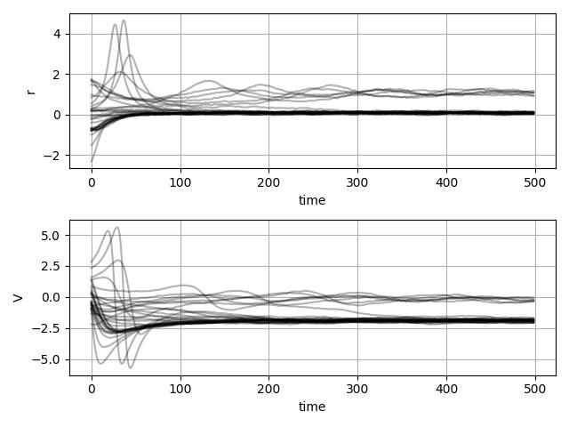
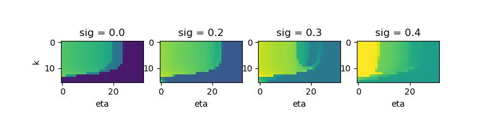
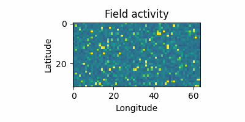

# `vbjax`

`vbjax` is a Jax-based package for working with virtual brain style models.

## Installation

Installs with `pip install "vbjax"`, but for the latest features, 
you can use the source,
```bash
git clone https://github.com/ins-amu/vbjax
cd vbjax
pip install -e ".[dev]"
```
You're encouraged to have the source handy to consult and change, but you can also just
```bash
pip install git+https://github.com/ins-amu/vbjax
```

The primary additional dependency of vbjax is
[JAX](github.com/google/jax), which itself depends only on
NumPy, SciPy & opt-einsum, so it should be safe to add to your
existing projects.

### gee pee you

#### CUDA
If you have a CUDA-enabled GPU, you install the requisite dependencies like so
```bash
pip install --upgrade "jax[cuda11_pip]" -f https://storage.googleapis.com/jax-releases/jax_cuda_releases.html
```

#### M1/M2 🍎

On newer Apple machines w/ M1, M2 or M3 GPUs, JAX supports using the GPU experimentally
by installing just two extra packages:
```
pip install ml-dtypes==0.2.0 jax-metal
```
About a third of vbjax tests fail due to absence of certain operations like n-dim
scatter/gather & FFTs, and it may not be faster because these CPUs already have
excellent memory bandwidth & latency hiding.

#### CUDA 🐳 

*BUT* because GPU software stack versions make aligning stars look like child's play,
container images are available and auto-built w/
[GitHub Actions](.github/workflows/docker-image.yml), so you can use w/ Docker
```bash
docker run --rm -it ghcr.io/ins-amu/vbjax:main python3 -c 'import vbjax; print(vbjax.__version__)'
```
The images are built on Nvidia runtime images, so `--gpus all` is enough
for Jax to discover the GPU(s).

## Examples

Here are some examples of simulations which show what you can
do with the library.  Because they are implemented atop Jax, it
is easy to take gradients for optimization or MCMC, or do efficient
GPU parallel batching. Or both ಠ_ರೃ  

### Simple network

Here's the smallest simulation you might want to do: 
an all-to-all connected network with Montbrio-Pazo-Roxin
mass model dynamics,

```python
import vbjax as vb
import jax.numpy as np

def network(x, p):
    c = 0.03*x.sum(axis=1)
    return vb.mpr_dfun(x, c, p)

_, loop = vb.make_sde(dt=0.01, dfun=network, gfun=0.1)
zs = vb.randn(500, 2, 32)
xs = loop(zs[0], zs[1:], vb.mpr_default_theta)
vb.plot_states(xs, 'rV', jpg='example1', show=True)
```


While integrators and mass models tend to be the same across publications, but
the network model itself varies (regions vs surface, stimulus etc), vbjax allows
user to focus on defining the `network` and then getting time series.

### Jacobians

Jax makes it easy to compute Jacobians,
```python
y0 = jp.r_[0.1, -2.0]

def eig1_tau(tau):
    theta = vb.mpr_default_theta._replace(tau=tau)
    J = jax.jacobian(vb.mpr_dfun)(y0, (0.4, 0.), theta)
    return jp.linalg.eigvals(J)[0]

jax.vmap(eig1_tau)( jp.r_[1.0:2.0:32j] ).real
```

### Parallel parameter space exploration

One of the key tools in use of these models is to run parameter sweeps, which
can be done easily with vbjax and parallelized with builtin Jax tools. 
```python
import jax, jax.numpy as np
import vbjax as vb
```
Let's
look at the effect of coupling, noise and excitability in a small network model,
where the `p` parameter is a tuple of coupling scaling, noise scaling and the
base MPR parameters:
```python
def net(x, p):
    r, v = x
    k, _, mpr_p = p
    c = k*r.sum(), k*v.sum()
    return vb.mpr_dfun(x, c, mpr_p)
```
to ensure noise is a parameter we can tune later, we'll define the SDE with
a dynamic noise scaled by the second element of the parameter tuple `p`,
```python
def noise(_, p):
    _, sigma, _ = p
    return sigma
```
turn that into an SDE, choose network size (8 nodes here), with random initial
conditions and realize an appropriate sample of noise for SDE integration:
```python
_, loop = vb.make_sde(0.01, net, noise)
n_nodes = 8
rv0 = vb.randn(2, n_nodes)
zs = vb.randn(1000, *rv0.shape)
```
to run map parameters of interest to some metric of interest, we write a function,
where we've chosen the standard deviation after a certain time as a index on the steady
state of the network dynamics,
```python
def run(pars, mpr_p=vb.mpr_default_theta):
    k, sig, eta = pars                      # explored pars
    p = k, sig, mpr_p._replace(eta=eta)     # set mpr
    xs = loop(rv0, zs, p)                   # run sim
    std = xs[400:, 0].std()                 # eval metric
    return std                              # done
```
all that is plain virtual brain equations, but to enable efficient & parallel
sweeps, we can pull in jax primitives `jax.pmap` to parallelize over compute
devices (by default, cores of the CPU) and `jax.vmap` to vectorize the function `run`,
*or* just a `jax.vmap` if using a GPU,
```python
if vb.is_cpu:
    run_batches = jax.pmap(jax.vmap(run, in_axes=1), in_axes=0)
else:
    run_batches = jax.vmap(run, in_axes=1)
```
now we run this over a parameter space (adapting for number of cores)
```python
# sweep sigma but just a few values are enough
sigmas = [0.0, 0.2, 0.3, 0.4]
results = []
ng = vb.cores*4 if using_cpu else 32
for i, sig_i in enumerate(sigmas):
    # create grid of k (on logarithmic scale) and eta
    log_ks, etas = np.mgrid[-9.0:-2.0:1j*ng, -4.0:-6.0:1j*ng]
    # reshape grid to big batch of values
    pars = np.c_[
        np.exp(log_ks.ravel()),
        np.ones(log_ks.size)*sig_i,
        etas.ravel()].T.copy()
    # cpu w/ pmap expects a chunk for each core
    if using_cpu:
        pars = pars.reshape((3, vb.cores, -1)).transpose((1, 0, 2))
    # now run
    result = run_batches(pars).block_until_ready()
    results.append(result)
```
and plot the results,
```python
import pylab as pl
pl.figure(figsize=(8,2))
for i, (sig_i, result) in enumerate(zip(sigmas, results)):
    pl.subplot(1, 4, i + 1)
    pl.imshow(result.reshape(log_ks.shape), vmin=0.2, vmax=0.7)
    pl.ylabel('k') if i==0 else (), pl.xlabel('eta')
    pl.title(f'sig = {sig_i:0.1f}')
pl.show()
pl.savefig('example3.jpg')
```


A full runnable script is in [`examples/parsweep.py`](examples/parsweep.py).

#### Performance notes

Is (vb)jax fast?  Single threaded C/C++ code typically reaches 50 to 200 thousand
iterations per second on a single CPU core, for network sizes of e.g. 164
(e.g. Destrieux atlas from FreeSurfer).  Let's check efficiency of the Jax code
for some hardware on my desk:

- Xeon W-2133 (2017 14 nm Skylake) uses 88 W to do 5.7 Miter/s = 65 Kiter/W
- Quadro RTX 5000 (2018 12 nm Turing) uses 200 W to do 26 Miter/s = 130 Kiter/W
- M1 Air (2020 5 nm M1) uses 18 W to do 3.7 Miter/s = 205 Kiter/W

You can tweak [this script](vbjax/tests/bench_vmap.py) to see what you might
expect on your hardware.

#### Distributed

If you are using a system like Dask or Slurm, you can then invoke 
that `run_batches` function in a distributed setting as required,
without needing to manage a per core or per node for loop.

### Simplest neural field 

Here's a neural field,
```python
import jax.numpy as np
import vbjax as vb

# setup local connectivity
lmax, nlat, nlon = 16, 32, 64
lc = vb.make_shtdiff(lmax=lmax, nlat=nlat, nlon=nlon)

# network dynamics
def net(x, p):
    c = lc(x[0]), 0.0
    return vb.mpr_dfun(x, c, p)

# solution + plot
x0 = vb.randn(2, nlat, nlon)*0.5 + np.r_[0.2,-2.0][:,None,None]
_, loop = vb.make_sde(0.1, net, 0.2)
zs = vb.randn(500, 2, nlat, nlon)
xt = loop(x0, zs, vb.mpr_default_theta._replace(eta=-3.9, cr=5.0))
vb.make_field_gif(xt[::10], 'example2.gif')

```


This example shows how the field forms patterns gradually despite the
noise in the simulation, due to the effect of local connectivity


### MCMC estimation of neural field activity

For MCMC estimates with NumPyro we define a function to compute
posterior log probability `p(theta | x)`,  
```python
  def logp(xt=None):
      x0h = numpyro.sample('x0h', dist.Normal(jnp.zeros((nlat, nlon)), 1))
      xth_mu = loop(x0h, ts, k)
      numpyro.sample('xth', dist.Normal(xth_mu, 1), obs=xt)
```
run MCMC w/ NUTS,
```python
  mcmc = MCMC(NUTS(logp), num_warmup=500, num_samples=500)
  mcmc.run(jax.random.PRNGKey(0), xt=xt)
  x0h = mcmc.get_samples()['x0h']
```
check diagnostics like estimated sample size, shrinkage and z-score,
```python
  ess = numpyro.diagnostics.effective_sample_size(x0h.reshape((1, 500, -1)))
  assert ess.min() > 100
  shrinkage, zscore = vbjax.shrinkage_zscore(x0, x0h, 1)
  assert shrinkage.min() > 0.7
  assert zscore.max() < 1.5
```
Full code is in the [test suite](vbjax/tests/test_field_inference.py), can
be run `pytest -m slow`, since it takes about 5 minutes to run on a GPU, 7 min on m1 CPU core and
12 minutes on an x86_64 CPU core.

### Fitting an autoregressive process

Here's a 1-lag MVAR
```python
import jax
import jax.numpy as np
import vbjax as vb

nn = 8
true_A = vb.randn(nn,nn)
_, loop = vb.make_sde(1, lambda x,A: -x+(A*x).mean(axis=1), 1)
x0 = vb.randn(nn)
zs = vb.randn(1000, nn)
xt = loop(x0, zs, true_A)
```
`xt` and `true_A` are the simulated time series and ground truth
interaction matrices. 

To fit anything we need a loss function & gradient descent,
```python

def loss(est_A):
    return np.sum(np.square(xt - loop(x0, zs, est_A)))

grad_loss = jax.grad(loss)
est_A = np.ones((nn, nn))*0.3  # wrong
for i in range(51):
    est_A = est_A - 0.01*grad_loss(est_A)
    if i % 10 == 0:
        print('step', i, 'log loss', np.log(loss(est_A)))

print('mean sq err', np.square(est_A - true_A).mean())
```
which prints
```
step 0 log loss 5.8016257
step 10 log loss 3.687574
step 20 log loss 1.7174681
step 30 log loss -0.15798996
step 40 log loss -1.9851608
step 50 log loss -3.7805486
mean sq err 8.422789e-05
```
This is a pretty simple example but it's meant to show that any model
you build with vbjax like this is usable with optimization or NumPyro's
MCMC algorithms.

### ƪ(ړײ)‎ƪ​​ moar examples‽

More complex examples are in the [examples](examples) folder:

- high resolution connectome neural field simulation & inference
- parameter sweep example
- *more examples  cooking* 🍩

## HPC usage

We use this on HPC systems, most easily with container images.  Open an issue if it doesn't work.

<details><summary>CSCS Piz Daint</summary>

Useful modules
```bash
module load daint-gpu
module load cudatoolkit/11.2.0_3.39-2.1__gf93aa1c
module load TensorFlow
```
then install in some Python environment; the default works fine
```bash
pip3 install "jax[cuda]==0.3.8" -f https://storage.googleapis.com/jax-releases/jax_cuda_releases.html
pip3 install "jaxlib==0.3.8+cuda11.cudnn805" -U -f https://storage.googleapis.com/jax-releases/jax_cuda_releases.html
```
This provides an older version of JAX unfortunately. 

The Sarus runtime can be used to make use of latest versions of vbjax and jax:
```bash
$ module load daint-gpu
$ module load sarus
$ sarus pull ghcr.io/ins-amu/vbjax:main
...
$ srun -p debug -A ich042 -C gpu --pty sarus run ghcr.io/ins-amu/vbjax:main python3 -c 'import jax; print(jax.numpy.zeros(32).device())'
...
gpu:0
```
</details>

<details><summary>JSC JUSUF</summary>

A nice module is available to get CUDA libs
```bash
module load cuDNN/8.6.0.163-CUDA-11.7
```
then you might set up a conda env,
```bash
wget https://repo.anaconda.com/miniconda/Miniconda3-latest-Linux-x86_64.sh
bash Miniconda3-latest-Linux-x86_64.sh -b -p ~/conda
. ~/conda/bin/activate
conda create -n jax python=3.9 numpy scipy
source activate jax
```
once you have an env, install the CUDA-enabled JAX
```bash
pip3 install --upgrade "jax[cuda]" -f https://storage.googleapis.com/jax-releases/jax_cuda_releases.html
```
and check it works
```bash
(jax) [woodman1@jsfl02 ~]$ srun -A icei-hbp-2021-0002 -p develgpus --pty python3 -c 'import jax.numpy as np ; print(np.zeros(32).device())'
gpu:0
```
JSC also makes Singularity available, so the prebuilt image can be used
```
TODO
```
</details>

<details><summary>CEA</summary>

The prebuilt image is the best route:
```
TODO
```
</details>

## Development

New ideas or even documenting tricks (like how Jax works) should go
into the test suite, and there are some ideas floating there before
making it into the library itself.
```
git clone https://github.com/ins-amu/vbjax
cd vbjax
pip install '.[dev]'
pytest
```

### Installing SHTns

This library is used for some testing.  It is impossible to install on 
Windows natively, so WSLx is required.  

On macOS,
```bash
brew install fftw
git clone https://bitbucket.org/nschaeff/shtns
./configure --enable-python --disable-simd --prefix=/opt/homebrew
make -j && make install && python setup.py install
```

### Releases
a release of version `v1.2.3` requires following steps
- [ ] `git checkout main`: tag releases from main for now
- [ ] edit `_version.py` to have correct release number
- [ ] `python -m vbjax._version tag` to create and push new tag
  - [GitHub tests, builds and pushes tag release to PyPI](.github/workflows/publish-tags.yml)
- [ ] use GitHub UI to create new release
