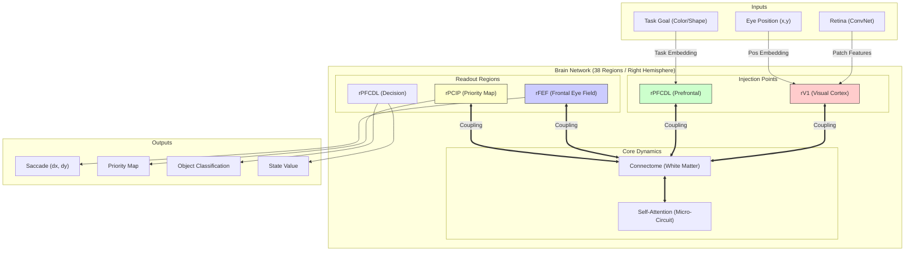
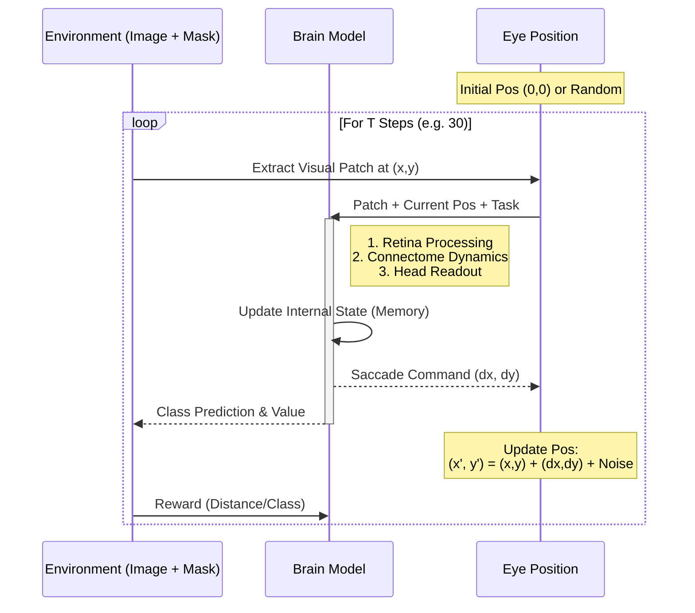
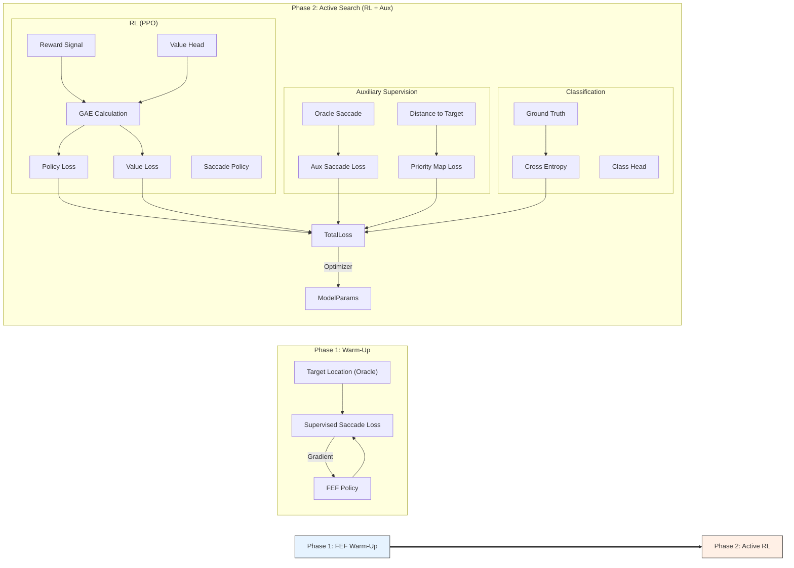
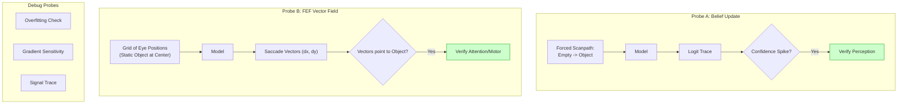

# Visual Search Model Diagrams

This document illustrates the architecture, task structure, training process, and verification probes for the Whole-Brain Visual Search Agent.

## 1. Whole-Brain Network Architecture

This diagram shows how visual information and task goals are injected into the brain network (Cortico-Thalamic MHSA) and how specific regions drive behavior.

## 2. Task Structure (Active Vision Loop)

This diagram illustrates the interaction between the agent and the environment over discrete time steps (fixations).

## 3. Training Curriculum

This diagram explains the multi-phase training strategy used to stabilize learning.

## 4. Verification Probes

This diagram details the probes used to verify the internal mechanics of the trained model.

